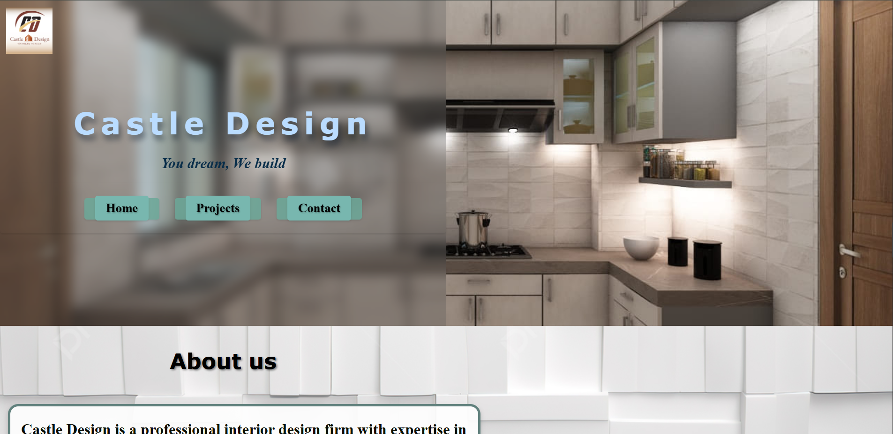

# 🏰 Castle Design

A responsive interior and architectural design showcase website built with HTML, CSS, and JavaScript.

## ✨ Overview

Castle Design presents a polished multi-page interface for showcasing design projects, services, and contact information. The site includes a visual home page, projects section, and contact page with responsive layouts for smaller screens.

## 🛠️ Technology Stack


## 🚀 Features

- 🏠 Attractive landing page
- 🖼️ Visual design/project showcase
- 📑 Dedicated projects page
- 📬 Contact page
- 📱 Responsive mobile layout
- 🎨 Background imagery and visual transitions
- 🧭 Multi-page navigation

## 📸 Screenshot

 

## 🚀 Run Locally

No build tools or package installation are required.

```bash
git clone https://github.com/raiyan-noob/castle-design.git
cd castle-design
```

Open `index.html` in a browser, or use VS Code Live Server for local development.

## 🔗 Links

- **Repository:** https://github.com/raiyan-noob/castle-design
- **Developer:** https://github.com/raiyan-noob

## 👨‍💻 Author

**Raiyan Anam**  
Computer Science & Engineering Student | Competitive Programmer | Software Developer

⭐ Feel free to explore the project and suggest improvements!
